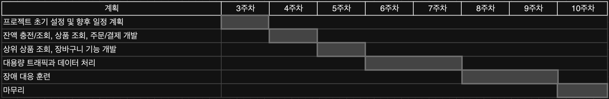
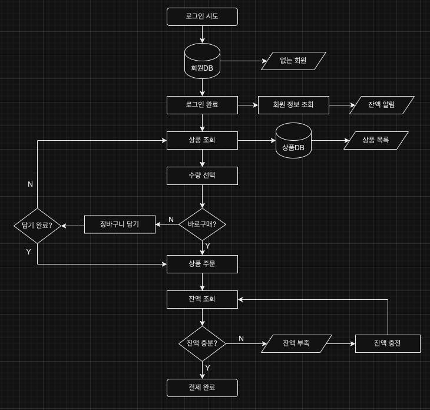
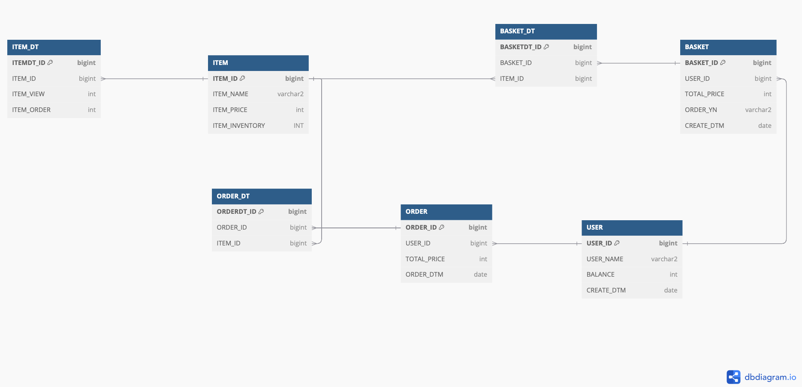
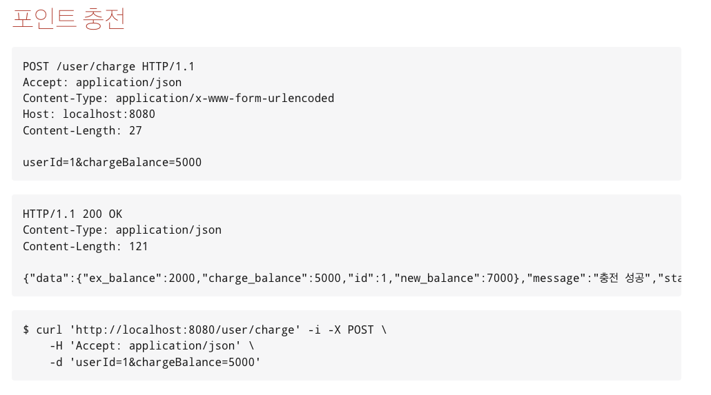
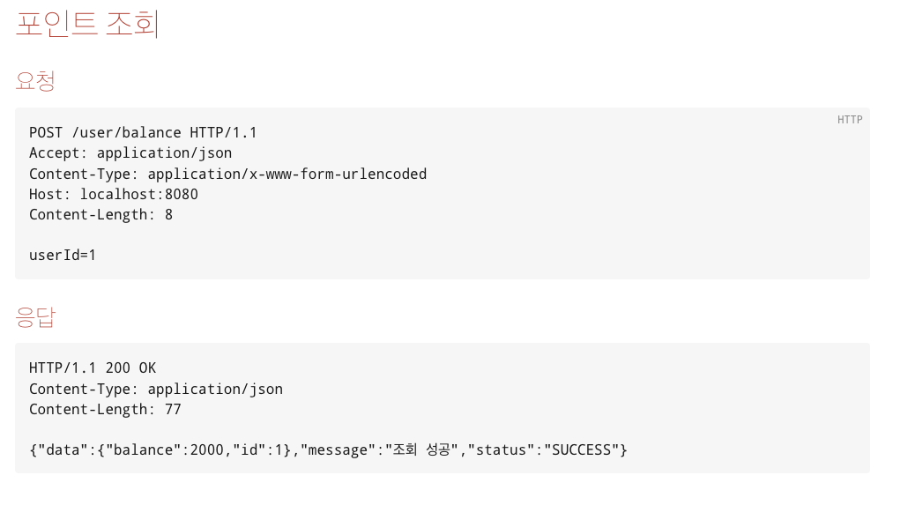

# 항해플러스 3주차 Step3

## 선택 시나리오 : e-커머스 서비스

### milestone
<details>
  <summary>milestone</summary>
3주차 (10월 05일 ~ 10월 11일)
- 프로젝트 초기 설정

4~5주차 (10월 12일 ~ 10월 25일)

- 기본 기능 구현
    - 잔액 충전/조회
    - 상품 조회
    - 주문/결제
- 추가 기능 구현
    - 상위 상품 조회
    - 장바구니 기능

6~7주차 (10월 26일 ~ 11월 08일)

- 대용량트래픽과 데이터 처리

8~9주차 (11월 09일 ~ 11월 22일)

- 장애 대응 훈련

10주차 (11월 23일 ~ 11월 29일)

- 마무리



</details>


### flow chart
<details>
  <summary>flow chart</summary>


</details>

### ERD
<details>
  <summary>ERD</summary>


</details>

### Api-Spec
<details>
  <summary>Api-Spec</summary>

<details>
  <summary>Spring REST Docs 예시</summary>



</details>

<details>
  <summary>이커머스_API_명세_v0.1</summary>

### 이커머스_API_명세_v0.1

**잔액 충전 / 조회 API**
<details>
  <summary>결제에 사용될 금액을 충전</summary>

> **POST**  */user/charge*
- Request
  ```json
  {
      "id": 1,
      "charge_balance": 5000
  }
  ```
- Response
  ```json
  {
    "status" : "SUCCESS",
    "message" : "충전 성공",
    "data" : {
      "id" : 1,
      "ex_balance" : 2000,
      "charge_balance" : 5000,
      "new_balance" : 7000
    }
  }
  ```
- Error
  ```json
  {
    "error": "Invalid request"
    "message": "충전에 실패했습니다."
  }
  ```
</details>

<details>
  <summary>해당 사용자의 잔액을 조회</summary>

> **POST** */user/balance*
- Request
  ```json
  {
    "id" : 1
  }	
  ```
- Response
  ```json
  {
    "status" : "SUCCESS",
    "message" : "조회 성공",
    "data" : {
      "id" : 1,
      "balance" : 2000,
    }
  }
  ```
- Error
  ```json
  {
    "error": "Invalid request"
    "message": "포인트 조회에 실패했습니다."
  }
  ```
</details>

**상품 조회 API**
<details>
  <summary>상품 정보을 조회</summary>

> **GET** */item/all*
- Response
  ```json
  {
    "status" : "SUCCESS",
    "message" : "조회 성공",
    "data" : [{
        "id" : 1,
        "price" : 1000,
        "name" : "청바지A",
        "stock" : 1
      },{
        "id" : 2,
        "price" : 2000,
        "name" : "슬랙스A",
        "stock" : 2
      },{
        "id" : 3,
        "price" : 3000,
        "name" : "후드티A",
        "stock" : 3
      },{
        "id" : 4,
        "price" : 4000,
        "name" : "맨투맨A",
        "stock" : 4
      }, ...
    }]
  }
  ```
- Error
  ```json
  {
    "error": "Invalid request"
    "message": "상품 목록 조회에 실패했습니다."
  }
  ```
</details>

**주문 / 결제 API**
<details>
  <summary>주문하고 결제를 수행</summary>

> **POST** */order/pay*
- Request
  ```json
  {
      "userId":1,
      "items": [{
        "id":1,
        "name":"청바지A",
        "price":1000
      }, {
        "id":2,
        "name":"후드티B",
        "price":4000
      }]
  }
  ```
- Response
  ```json
  {	
      "status" : "SUCCESS",
      "message" : "구매 성공",
      "data" : {
        "order" : {
        "orderId" : 1,
        "userId" : 1,
        "order_item_count":2
        "total_price": 5000
        "order_dtm" : "2024-10-10 22:32:54"
        },
          "items": [{
              "id":1,
              "name":"청바지A",
              "price":1000
          }, {
              "id":2,
              "name":"후드티B",
              "price":4000
          }]
      }
  }
  ```
- Error
  ```json
  {
      "error": "Invalid request"
      "message": "구매에 실패했습니다."
  }
  ```
</details>

**상위 상품 조회 API**
<details>
  <summary>최근 3일간 가장 많이 팔린 상위 5개 상품 정보를 제공</summary>

> **GET** */item/popular*
- Response
  ```json
  {	
      "status" : "SUCCESS",
      "message" : "조회 성공",
      "data" : [{
              "id" : 1,
              "name" : "청바지A",
              "price" : 1000,
              "stock" : 1,
              "rank" : 1,
              "view" : 5550,
              "order" : 5000
          },{
              "id" : 2,
              "name" : "슬랙스A",
              "price" : 2000,
              "stock" : 2,
              "rank" : 2,
              "view" : 4440,
              "order" : 4000
          },{
              "id" : 3,
              "name" : "후드티A",
              "price" : 3000,
              "stock" : 3,
              "rank" : 3,
              "view" : 3330,
              "order" : 3000
          },{
              "id" : 4,
              "name" : "맨투맨A",
              "price" : 4000,
              "stock" : 4,
              "rank" : 4,
              "view" : 2220,
              "order" : 2000
          },{
              "id" : 4,
              "name" : "후드티B",
              "price" : 4000,
              "stock" : 4,
              "rank" : 5,
              "view" : 1110,
              "order" : 1000
          }
      }]
  }
  ```
- Error
  ```json
  {
    "error": "Invalid request",
    "message": "인기 상품 목록 조회에 실패했습니다."
  }
  ```
</details>
</details>
</details>


### 주요 기술 스택
<details>
  <summary>기술 스택 </summary>

- **Java 버전**: 17
- **Spring Boot 버전**: 3.3.1
- **데이터베이스**: H2 + @
- **ORM**: Spring Data JPA, QueryDSL
- **API 문서**: Spring REST Docs
</details>

### 패키지 구조
<details>
  <summary>패키지 구조</summary>

아직 미정...
토요일까지 개인공부 후에 정할 예정 (레이어 + 클린)
</details>
