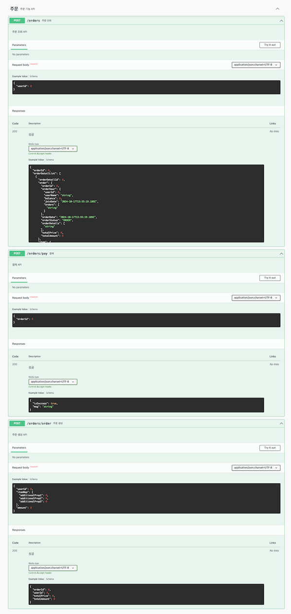

# 항해플러스 3주차 Step3

## 선택 시나리오 : e-커머스 서비스

### milestone
<details>
  <summary>milestone</summary>
3주차 (10월 05일 ~ 10월 11일)
- 프로젝트 초기 설정

4~5주차 (10월 12일 ~ 10월 25일)

- 기본 기능 구현
    - 잔액 충전/조회
    - 상품 조회
    - 주문/결제
- 추가 기능 구현
    - 상위 상품 조회
    - 장바구니 기능

6~7주차 (10월 26일 ~ 11월 08일)

- 대용량트래픽과 데이터 처리

8~9주차 (11월 09일 ~ 11월 22일)

- 장애 대응 훈련

10주차 (11월 23일 ~ 11월 29일)

- 마무리


</details>


### flow chart
<details>
  <summary>flow chart</summary>


</details>

### ERD
<details>
  <summary>ERD</summary>


</details>

### Swagger
<details>
  <summary>swagger</summary>




</details>


### Api-Spec
<details>
  <summary>Api-Spec</summary>

### 이커머스_API_명세_v0.1

**잔액 충전 / 조회 API**
<details>
  <summary>결제에 사용될 금액을 충전</summary>

> **POST**  */user/charge*
- Request
  ```json
  {
      "id": 1,
      "charge_balance": 5000
  }
  ```
- Response
  ```json
  {
    "status" : "SUCCESS",
    "message" : "충전 성공",
    "data" : {
      "id" : 1,
      "ex_balance" : 2000,
      "charge_balance" : 5000,
      "new_balance" : 7000
    }
  }
  ```
- Error
  ```json
  {
    "error": "Invalid request"
    "message": "충전에 실패했습니다."
  }
  ```
</details>

<details>
  <summary>해당 사용자의 잔액을 조회</summary>

> **POST** */user/balance*
- Request
  ```json
  {
    "id" : 1
  }	
  ```
- Response
  ```json
  {
    "status" : "SUCCESS",
    "message" : "조회 성공",
    "data" : {
      "id" : 1,
      "balance" : 2000,
    }
  }
  ```
- Error
  ```json
  {
    "error": "Invalid request"
    "message": "포인트 조회에 실패했습니다."
  }
  ```
</details>

**상품 조회 API**
<details>
  <summary>상품 정보을 조회</summary>

> **GET** */item/all*
- Response
  ```json
  {
    "status" : "SUCCESS",
    "message" : "조회 성공",
    "data" : [{
        "id" : 1,
        "price" : 1000,
        "name" : "청바지A",
        "stock" : 1
      },{
        "id" : 2,
        "price" : 2000,
        "name" : "슬랙스A",
        "stock" : 2
      },{
        "id" : 3,
        "price" : 3000,
        "name" : "후드티A",
        "stock" : 3
      },{
        "id" : 4,
        "price" : 4000,
        "name" : "맨투맨A",
        "stock" : 4
      }, ...
    }]
  }
  ```
- Error
  ```json
  {
    "error": "Invalid request"
    "message": "상품 목록 조회에 실패했습니다."
  }
  ```
</details>

**주문 / 결제 API**
<details>
  <summary>주문하고 결제를 수행</summary>

> **POST** */order/pay*
- Request
  ```json
  {
      "userId":1,
      "items": [{
        "id":1,
        "name":"청바지A",
        "price":1000
      }, {
        "id":2,
        "name":"후드티B",
        "price":4000
      }]
  }
  ```
- Response
  ```json
  {	
      "status" : "SUCCESS",
      "message" : "구매 성공",
      "data" : {
        "order" : {
        "orderId" : 1,
        "userId" : 1,
        "order_item_count":2
        "total_price": 5000
        "order_dtm" : "2024-10-10 22:32:54"
        },
          "items": [{
              "id":1,
              "name":"청바지A",
              "price":1000
          }, {
              "id":2,
              "name":"후드티B",
              "price":4000
          }]
      }
  }
  ```
- Error
  ```json
  {
      "error": "Invalid request"
      "message": "구매에 실패했습니다."
  }
  ```
</details>

**상위 상품 조회 API**
<details>
  <summary>최근 3일간 가장 많이 팔린 상위 5개 상품 정보를 제공</summary>

> **GET** */item/popular*
- Response
  ```json
  {	
      "status" : "SUCCESS",
      "message" : "조회 성공",
      "data" : [{
              "id" : 1,
              "name" : "청바지A",
              "price" : 1000,
              "stock" : 1,
              "rank" : 1,
              "view" : 5550,
              "order" : 5000
          },{
              "id" : 2,
              "name" : "슬랙스A",
              "price" : 2000,
              "stock" : 2,
              "rank" : 2,
              "view" : 4440,
              "order" : 4000
          },{
              "id" : 3,
              "name" : "후드티A",
              "price" : 3000,
              "stock" : 3,
              "rank" : 3,
              "view" : 3330,
              "order" : 3000
          },{
              "id" : 4,
              "name" : "맨투맨A",
              "price" : 4000,
              "stock" : 4,
              "rank" : 4,
              "view" : 2220,
              "order" : 2000
          },{
              "id" : 4,
              "name" : "후드티B",
              "price" : 4000,
              "stock" : 4,
              "rank" : 5,
              "view" : 1110,
              "order" : 1000
          }
      }]
  }
  ```
- Error
  ```json
  {
    "error": "Invalid request",
    "message": "인기 상품 목록 조회에 실패했습니다."
  }
  ```
</details>
</details>


### 주요 기술 스택
<details>
  <summary>기술 스택 </summary>

- **Java 버전**: 17
- **Spring Boot 버전**: 3.3.1
- **데이터베이스**: H2 + @
- **ORM**: Spring Data JPA, QueryDSL
- **API 문서**: Spring REST Docs
</details>

### 패키지 구조
<details>
  <summary>패키지 구조</summary>

아직 미정...
토요일까지 개인공부 후에 정할 예정 (레이어 + 클린)
</details>

### 중간 회고록
<details>
  <summary>중간회고록</summary>

### 1. 2-1  시나로이 분석 및 작업 계획
해당 주차를 쉬어가는 타이밍이라고 생각을 했다.

그전에 빡세게 한것도 아니면서 보상심리가 있었나보다... 

해당 주차에 가벼운 마음으로 프로젝트를 정하고 시나리오를 짜고 정말 가벼운 마음으로 했다.

이것이 후폭풍으로 돌아올것이라고 생각을 못하고... 

### 2-2  비즈니스 로직 개발 및 유닛&통합 테스트 작성 
전 주차에 설렁설렁하던것이 스노우볼이 되어서 굴러왔다. 

개발을 하면서 계속 바뀌는 erd와 시나리오... 처음부터 완벽할수는 없다지만 이번에는 내가 너무 안일했다. 

일을하면서 항상 주어진일만 진행해왔고 뭔가 주도적으로는 안했었구나를 많이 깨달은 주간이였다.

하지만 이때 뭔가 확실하지 않았던 TDD, 유닛(단위) 테스트의 개념이 살짝쿵 잡히기 시작했고, 많은 수정이 있엇지만 잘 진행했다. 

점점 깔끔해지는 팀원들의 PR과 코드들을 보면서 많이 참고하고 노력했던 한주였던것 같다. 

### 2-3  exception과 filter(interceptor) 적용 & 동시성 통합 테스트 작성
전 주차를 그래도 나름 잘 끝냈다고 생각하고 진행하고 있었는데...

코치님과의 멘토링 그리고 학습메이트와의 이야기를 통해 아직도 많이 변경해야될게 많다는것을 느꼈다. 

그 전부터 점차 알고있던 나의 메타인지... 그 것이 멘토링에서 더 크게 느껴졌던거 같다.

많이 부족하고 많은 것을 놓치면서 회사에서 시키는 거만 하고있다는 것을 느꼈다. 

그와 동시에 약간의 공부 방향성에 대해서 감을 잡은 한주가 되었던거 같다.

이것을 다 느끼기도 전에 학습메이트 태한님께서 DIP가 적용안되어있다라는 말을 해주셨다.

함꼐 코드를 보며 DIP에 대해 또 DIP의 적용에 대해서 말해주셨다.

이런거를 보며 느낀 것은 내가 평소에 객체지향적은 물론 너무 생각없이 일을 해왔구나 라는 생각이 들었다.

시작할때 들었던 방향성을 잡아준다는게 이런걸까 라는 생각이 들면서 메타인지가 제대로 된 한주였다.

</details>

### STEP 11 
<details>
  <summary>동시성</summary>

### 1. 나의 시나리오에서 발생할 수 있는 동시성 이슈
이커머스에서 발생 할 수 있는 동시성 이슈에는 4가지가 있다.
1. 포인트 충전
2. 포인트 차감
3. 재고 복원
4. 재고 차감

### 2. 사용할 동시성 제어 방식

1. [낙관적 락 & 비관적 락](https://taekoon.tistory.com/50)
2. [분산락](https://taekoon.tistory.com/52)
   1. [Redis의 Lock 제어 방식](https://taekoon.tistory.com/53)

위 이커머스의 네가지 동시성 이슈에 적합하다고 생각한 제어 방식은 
1. 포인트 충전 = 낙관적 락
     * 포인트는 개인만 접근하여 사용 할 수 있다.
     * 읽기와 쓰기가 많이 발생하지 않는다는 생각이 든다.
     * 따라서 포인트 충전에는 낙관적 락으로도 충분할 것 같다.
     * 테스트 시간에서도 낙관적락이 사알짝 빠르다.
     * 
     * 
2. 포인트 차감 = 낙관적 락
   * 위와 같은 이유로 포인트에는 낙관적 락을 적용했다. 
   * 공유 자원이 아닌 공유 자원에는 낙관적 락이 적절하다라는 말에 동의를 한다.
   * 
   * 
3. 상품 재고 복원 = 비관적 락
   * 재고 차감과는 달리 복원의 경우에는 분산락을 적용시킬만큼 많은 요청이 오지 않을꺼같다.
   * 
4. 상품 재고 차감 = 분산락
   * 가장 많이 사용을 하는 로직이기때문에 분산락을 적용시켜보겠습니다. 
   * 또한 [Redisson](https://taekoon.tistory.com/53) 라이브러리를 이용하여 Pub/Sub 구독 기능을 이용해 Lock을 제어
   * 

</details>

### STEP 13
<details>
  <summary>캐쉬</summary>

[캐쉬에 대하여...](https://taekoon.tistory.com/56)

### 1. 캐싱할 로직
우선 캐싱의 목적은 확실하다. 

*DB에 부하를 주거나 조회가 빈번하게 일어나는 로직*  

이러한 부분을 나의 이커머스에서 몇개 찾아보았다.

1. 최근 인기 상위 상품 조회
   * 지난 3일간의 인기상품을 보여주니 데이터의 변동성이 적다.
   * 여러 사용자가 같은 데이터를 조회하기때문에 캐시에 저장해두면 많은 이득을 볼꺼같다.
   * 매일 00시 00분에 지난 3일단의 인기상품을 보여주는 것으로 진행할려고함
   * 그렇게 되면 매일 동일한 시간에 캐쉬를 업데이트해줘야될꺼같음 
   * Refresh-Ahead 전략을 사용하여 일정 시간에 미리 업데이트를 진행할 예정이다.

2. 모든 상품 조회
   * 실제로 가장 많이 조회가 되는 부분
   * 많은 양이 있고, 많은 조회가 일어난다.
   * Cache-Aside 전략을 사용하여 적용한다. 
   * 만약 재고가 0이 되어서 판매종료된다면 해당 내용을 다시 조회한다.

</details>

### STEP 14
<details>
  <summary>인덱스</summary>

[인덱스에 대하여...](https://taekoon.tistory.com/58)

### 1. 테이블 별 인덱스
쿼리분석 전에 단순히 테이블만 확인했을때 필요한 인덱스들을 생각해봤습니다.
  - Basket Table

    장바구니 테이블에서 적용할 인덱스는 딱 하나밖에 안보인다.
    장바구니를 조회할때는 user_id를 가지고 조회를 하기때문에 해당 테이블에는 user_id에만 인덱스를 적용해준다.
  - Basket_Detail Table

    장바구니 상세 테이블에서도 인덱스를 적용할 컬럼은 딱 하나만 보인다.
    장바구니 상세를 조회할때 사용하는 값은 basket_id 밖에 없으니 해당 컬럼에만 인덱스를 적용해준다.
  - Item Table
    
    아무래도 이커머스에서 가장 많이 사용되어지는 테이블이 아닐까 싶다. 
    
    1. 이름 검색이 많을 테니깐 item_name (해당 프로젝트에는 이름검색은 아직 구현하지 않았음) 
    2. 금액의 범위로도 조회할 수 있으니 item_price 
  - Orders Table
    
    주문을 조회할때는 사용자의 구매목록을 조회하는 일이 대부분일꺼같으므로 user_id에 인덱스를 걸어준다. 
  - Orders_Detail Table

    주문 상세에서는 주문번호를 가지고만 조회가 일어날꺼같으니 order_id에 인덱스를 걸어준다.

### 2. 쿼리 별 인덱스 

테이블 별 인덱스를 제외하고 자주 실행될꺼같은 쿼리에서 인덱스들을 생각해봤습니다.
1. 장바구니 기능
   - Basket_Detail - item_id
   
        장바구니 상세 추가,삭제에서 item_id 기준으로 검색을 자주 일어날꺼같다라는 생각이 든다.
2. 판매 상위 검색
    - Order - order_date 

        3일동안이라는 기준이 있어서 Order에 order_date 인덱스를 추가해준다.

</details>

