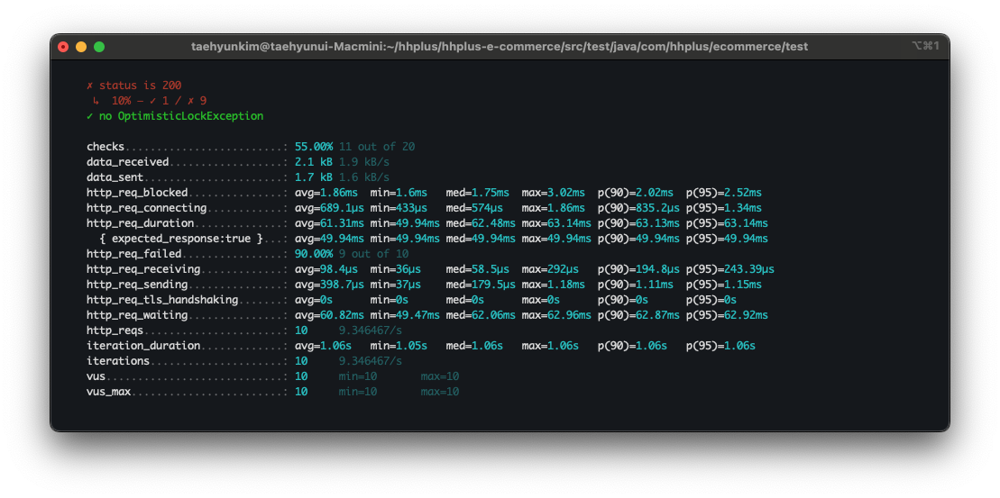
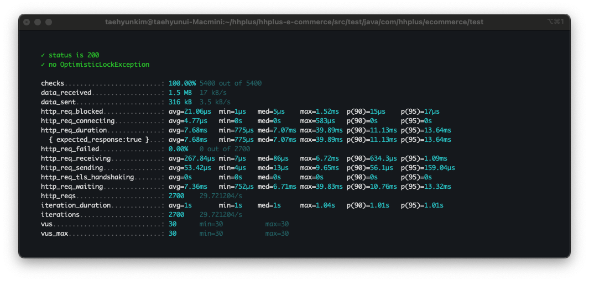
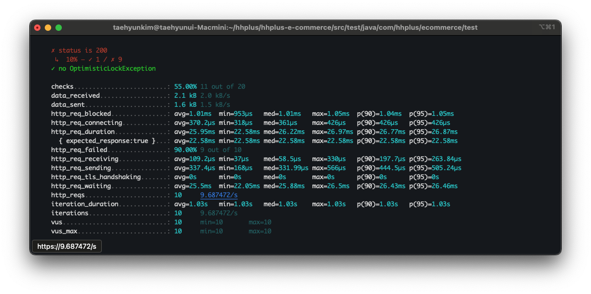

# STEP 19

## 부하 테스트 대상 선정 및 목적, 시나리오 등의 계획
<details>
  <summary>부하 테스트란?</summary>

부하 테스트란?
시스템이 높은 트래픽이나 과부하 상황에서도 안정적으로 동작하는지를 확인하기 위해 수행되는 테스트
부하 테스트를 통해서 성능 병목 지점을 찾아내고, 시스템의 최대 처리 용량과 안전성을 평가할 수 있기에 진행한다.

해당 사양으로 **최대 처리량을 확인**합니다. 

정상적으로 처리할 수 있는 **최대 동시 사용자 수나 요청의 수를 파악**합니다.

해당 기능들을 수행하면서 메모리, 쿼리, 네트워크 등 자원에 대해서 제한되는 부분인 **병목 지점을 식별**합니다.

이를 진행하면서 부족한 부분들을 찾아 과부하 상황에서 예측이 가능하게 동작되게 설계를 하고, 부하가 일어날때 추가 리소스를 활용 할 수 있는지 확인합니다. 

이러한 부분들을 통해 배포 전에 실제 상황에 가까운 환경에서 테스트해 **문제를 사전에 해결** 할 수 있도록 노력합니다.


</details>

<details>
  <summary>대상 선정</summary>

제생각에는 이커머스에서 가장 주요한 부분인 **돈과 관련된 부분**이 부하 테스트의 대상이 됩니다.

1. 포인트 충전 : 실제 서비스에서는 고객의 돈과 관련된 부분임으로 문제가 발생되면 안됩니다.
2. 상품조회 : 상품조회가 안되는 일이 있으면 안되므로 대상에 선정
3. 결제 (포인트 사용 및 제고 처리) : 해당 부분에서는 절대로 문제가 생기면 안되기 때문에 필히 진행해야됩니다.

</details>


<details>
  <summary>테스트 계획</summary>

사용도구 선정
1. JMeter
   * JMeter는 초보자도 쉽게 시작을 할수 있고, 확장성이 좋으며 자료가 풍부하다고한다.
   * 하지만 높은 리소스를 사용하고 복잡한 테스트 스크립트를 작성해야되며 다소 무겁고 구식인 단점이 있다.
2. nGrinder
   * 직관적인 웹 인터페이스를 제공하며, 스크립트 작성이 용이하며 클라이언트 리소스에 영향을 적게 받고 관리가 편리하다.
   * 설치과 구성 설정이 복잡할 수가 있으며 이로인해 초반에 러닝커브가 있는편이고 확장에 제한적이라는 단점이 있다.
3. K6
   * 위 두개와 비교해서 좀 더 가벼우며 JavaScript를 사용하여 테스트 스크립트를 작성해서 유지보수가 용이하다.
   * CLI사용이며 초기 러닝커브가 있는편이고 분산테스트에서 제약이 좀 있다는 단점이 있다고 한다.


이러한것을 종합해봤을때, 이번 분산테스트에서 진행할 도구는 **JMeter**를 사용하여 진행할 것이다.

JMeter를 가지고 **Load Test & Peak Test**를 진행할 예정이다.

이였지만....!

JMeter는 상대적으로 오래되었고 요즘엔 K6를 많이 사용한다.

따라서 다시 K6로 작업을 해보겠다.

</details>

<details>
  <summary>테스트</summary>

* 포인트 충전
```javascript
import http from 'k6/http';
import { check, sleep } from 'k6';

export const options = {
    stages: [
        { duration: '30s', target: 10 }, // 10명의 사용자로 부하 증가
        { duration: '1m', target: 50 },  // 50명의 사용자 유지
        { duration: '30s', target: 0 },  // 부하 감소
    ],
};

// API URL 및 테스트 데이터 설정
const BASE_URL = 'http://localhost:8080'; // API 서버 주소
const API_ENDPOINT = '/user/charge'; // 잔액 충전 API 경로

export default function () {
    const payload = JSON.stringify({
        userId: 1,         // 충돌을 유발하기 위해 동일한 사용자 ID 사용
        balance: 100,      // 충전 금액
    });

    const params = {
        headers: {
            'Content-Type': 'application/json',
        },
    };

    // POST 요청 전송
    const res = http.post(`${BASE_URL}${API_ENDPOINT}`, payload, params);

    // 응답 검증
    check(res, {
        'status is 200': (r) => r.status === 200, // 성공 상태 확인
        'no OptimisticLockException': (r) =>
            !r.body.includes('OptimisticLockException'), // 예외 발생 여부 확인
    });

    // 사용자 요청 간 대기 시간
    sleep(1);
}
```



* 상품 목록 조회
```javascript
export const options = {
   vus: 30,
   duration: '90s',
};

// API URL 및 테스트 데이터 설정
const BASE_URL = 'http://localhost:8080';
const API_ENDPOINT = '/items';

export default function () {

   const params = {
      headers: {
         'Content-Type': 'application/json',
      },
   };

   // POST 요청 전송
   const res = http.get(`${BASE_URL}${API_ENDPOINT}`, params);

   // 응답 검증
   check(res, {
      'status is 200': (r) => r.status === 200, // 성공 상태 확인
      'no OptimisticLockException': (r) =>
              !r.body.includes('OptimisticLockException'), // 예외 발생 여부 확인
   });

   // 사용자 요청 간 대기 시간
   sleep(1);

}
```


* 주문결제
```javascript
export const options = {
    vus: 10,
    iterations: 10,
};

// API URL 및 테스트 데이터 설정
const BASE_URL = 'http://localhost:8080';
const API_ENDPOINT = '/orders/pay';

export default function () {
    const payload = JSON.stringify({
        orderId: 1         // 충돌을 유발하기 위해 동일한 주문 ID 사용
    });

    const params = {
        headers: {
            'Content-Type': 'application/json',
        },
    };

    // POST 요청 전송
    const res = http.post(`${BASE_URL}${API_ENDPOINT}`, payload, params);

    // 응답 검증
    check(res, {
        'status is 200': (r) => r.status === 200, // 성공 상태 확인
        'no OptimisticLockException': (r) =>
            !r.body.includes('OptimisticLockException'), // 예외 발생 여부 확인
    });

    // 사용자 요청 간 대기 시간
    sleep(1);

}
```

</details>