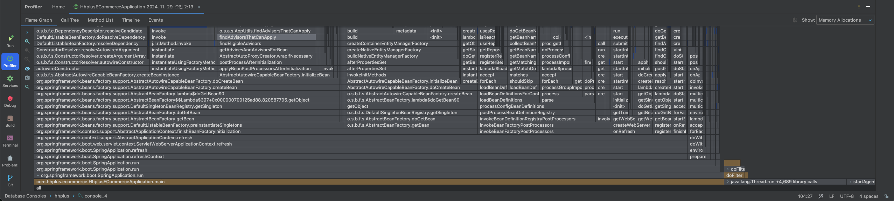
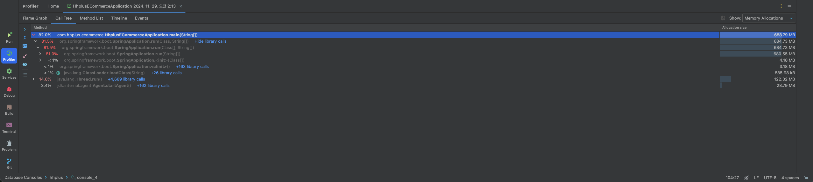
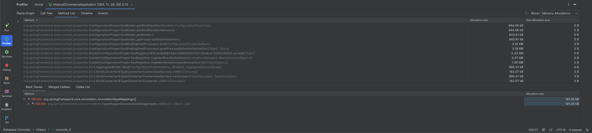

# STEP 20

### 성능 지표

  
성능지표

이번 멘토링에서 들은 Intellj의 내장되어있는 Profile을 사용해보았음

* Flame Grghp

* Call Tree

* Method List

로이 코치님의 블로그를 보고 따라해보고 분석을 해볼려고 했으나...

아직 보는 법이 익숙하지 않은것같다. 

현업 업무에서도 적용해서 볼려면 이런 조그마한 개인프로젝트에서 보는법을 연습해서 가야겠다고 생각하였다.

이것을 토대로 회사업무에서 사용하고 있는 제니퍼 또는 와탭에서도 한번 더 꼼꼼히 보게 될 것 같다.

### 장애 대응

  
장애 대응

    
장애 대응에서 가장 중요하다고 생각하는 것은 그것을 얼마나 빨리 인지를 하느냐가 제일 중요한것 같다. 

실제 일하고 있는 곳에서는 특정 조건들에 부합하면 사내메일로 알람이 오고 있는 상황이다.

현재 내 프로젝트에서는 일정 수준의 부하가 발생되면 알림이 오게 한다거나,

중요한 로직에서 exception이 뜨면 알람이 오게하면 좋은 장애 대응이 될 것 같다.

또한 장애가 일어 났을떄 그에 대한 후속 대응도 중요하다.

장애 대응에 있어서 토투 코치님이 하신 말씀 중에 공감이되는 말들이 있었다. 

`코드에서 장애가 발생되면 해당 작업을 한 직원은 밴치로 가야된다. 현재 그의 IQ는 돌고래다.`

`코드리뷰는 자신이 짠 로직을 다른 사람도 알게되어 장애대응에 도움이되는 효과도 있다.`

이렇게 팀원들끼리 서로의 코드를 잘 알고있고 많은 공유와 리뷰를 하고있으면 장애대응에 좀더 쉽다라는 생각을 하였다.

물론 장애가 안나면 좋겠지만은 그럴수는 없고 `얼마나 빨리 아느냐`, `얼마나 신속히 처리하느냐` 가 장애 대응에 있어서는 최선의 대처가 될 것 같다.

